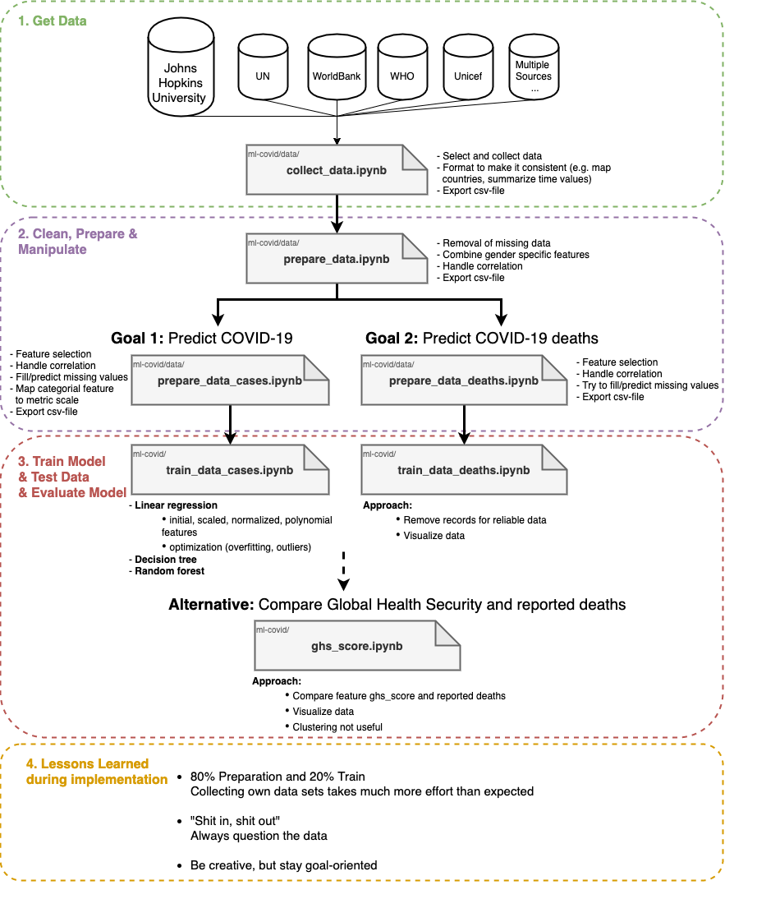

# ml-covid

> Coronafall- und -todeszahlenvorhersage je Land aufgrund anderer potenzieller Einflussfaktoren

## Idee

Unsere ursprüngliche Idee war es COVID-19-Fallzahlen für Länder vorherzusagen, die keine oder klar ersichtlich falsche Zahlen veröffentlichen (sei es politisch motiviert oder aufgrund ungenügender Test-/Diagnosekapazitäten).

Dies ist allerdings schwierig, da Trainings- und Testdaten vermutlich zu stark voneinander abweichen würden (vereinfacht ausgedrückt würde vermutlich ein Model mit Daten von Industrienationen trainiert werden, das dann auf Entwicklungsländer übertragen werden soll bzw. ein Modell, dass Entwicklungsländern weitaus weniger Fälle zuschreibt, da diese aufgrund ihrer Testkapazitäten konsistent weniger gemeldet haben).

Wir haben uns daher auf die allgemeine Fall- und Todeszahlenvorhesage konzentiert.
Dazu sollen mehrere Faktoren betrachtet werden, wie etwa die wirtschaftlichen Gegebenheiten eines gewissen Landes und die daraus resultierende medizinische Versorgung.
Zu diesen wirtschaftlichen Daten sollen ebenfalls Informationen zur Bevölkerung, also dem Alter oder der Bevölkerungsdichte, verwendet werden, um eine potentiell verlässliche Vorhersage treffen zu können.

## Aufbau Repository (und Datenquellen)

Alle verwendeten Daten werden im `/data`-Ordner untergebracht.
Dabei werden diese zunächst als Rohdaten in `/data/raw` gespeichert und anschließend aufbereitet.

Eine Übersicht über die genutzten Datensätze
- viele Features gesucht &rarr; korrelieren zum Teil stark untereinander &rarr; nicht alle benutzbar

- Datenquellen u.a. von Kaggle, WHO, Weltbank, Vereinte Nationen, JHU

## Vorgehen

- daten aufbereiten und zusammenführen
  - [Collect Data](data/collect_data.ipynb)
  - [Vorbereitungen allgemein](data/prepare_data.ipynb)
  - [Vorbereitungen Fallzahlen](data/prepare_data_cases.ipynb)
  - [Vorbereitungen Todeszahlen](data/prepare_data_deaths.ipynb)
- korrelationen untersuchen, features rausschmeißen
- fehlende Werte vorhersagen
- Modelle trainieren
- Modelle evaluieren

## Ergebnis/Auswertung/Interpretation
-> Vor- und Nachteile der Modelle
-> Interpretieren der Ergebnisse!

- zahlreiche weitere Einflussfaktoren
  - politische Reaktion
  - Akzeptanz von Maßnahmen in der Bevölkerung
    - Einhaltung Lockdown
    - Tragen von Masken
    - Proteste und bewusstes Verstoßen gegen Auflagen
- Vorbereitung auf Pandemie scheint zweitrangig
  - Bsp.: USA nach GHS-Index bestens vorbereitet, allerdings überproportionaler Anteil unter Infizierten
- Umwelteinflüsse, wie poltische Entscheidungen, sind relevant, können jedoch nicht / nur schwer als Daten einbezogen werden
- Validität der Daten

## Learnings
- Da die Ergebnisse und der Lösungsweg bei dieser Zielsetzung nicht vorhersehbar war, hatten wir das Gefühl mehr zu Lernen und waren mehr gefordert.  
- viele Daten reichen nicht immer aus, um ein erfolgreiches Ergebnis zu erhalten
- Daten sammeln ist der Löwenanteil der Arbeit
- "Wenn Daten nicht valide sind, kann halt nix Vernünftiges bei rumkommen"

### Last words

In the end all our results may have failed, but we believe this is because of the data.
We simply cannot predict case numbers that are far more reliable on actual taken measures by each country than on their theoretical preparedness.
Another important aspect of this is the authenticity of the used data, because many countries with either a poor health care system or other motives do not report accurate numbers.
We tried to combat this with the health care expenditures, but that simply does not account for all different factors that are at play.