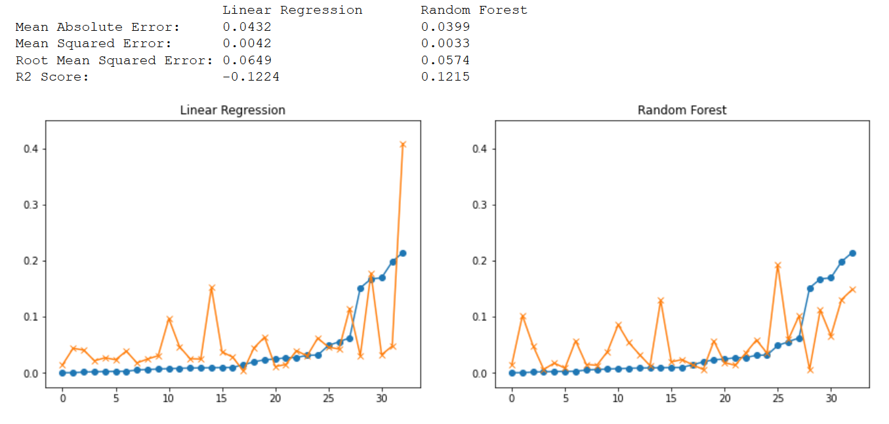

# ml-covid

> Vorhersage der Coronafall- und -sterbezahlen je Land mithilfe potenzieller, unterschiedlicher Einflussfaktoren

## Idee

Unsere ursprüngliche Idee war es COVID-19-Fallzahlen für Länder vorherzusagen, die keine oder klar ersichtlich falsche Zahlen veröffentlichen (sei es politisch motiviert oder aufgrund ungenügender Test-/Diagnosekapazitäten).

Dies ist allerdings schwierig, da Trainings- und Testdaten vermutlich zu stark voneinander abweichen würden (vereinfacht ausgedrückt würde vermutlich ein Model mit Daten von Industrienationen trainiert werden, das dann auf Entwicklungsländer übertragen werden soll bzw. ein Modell, dass Entwicklungsländern weitaus weniger Fälle zuschreibt, da diese aufgrund ihrer Testkapazitäten konsistent weniger gemeldet haben).

Wir haben uns daher auf die allgemeinen Fall- und Sterbezahlenvorhesage konzentiert.
Dazu sollen mehrere Faktoren betrachtet werden, wie etwa die wirtschaftlichen Gegebenheiten eines gewissen Landes und die daraus resultierende medizinische Versorgung.
Zu diesen wirtschaftlichen Daten sollen ebenfalls Informationen zur Bevölkerung, also dem Alter oder der Bevölkerungsdichte, verwendet werden, um eine potentiell verlässliche Vorhersage treffen zu können.

## Aufbau Repository (und Datenquellen)

Alle verwendeten Daten werden im `/data`-Ordner untergebracht.
Dabei werden diese zunächst als Rohdaten in `/data/raw` gespeichert und anschließend aufbereitet.

Eine Übersicht über die genutzten Datensätze sowie die Auswahl der Features befindet sich in den [Quellen](quellen.md).
Für die Bestimmung der Fall- bzw. Sterbezahlen von COVID-19 haben wir einige mögliche Features gesucht und zusammengestellt.
Dafür haben wir u. a. Daten von der JHU, der WHO, der Weltbank, den Vereinte Nationen und Kaggle verwendet.

## Vorgehen

Der erste Schritt einer jeden _Machine-Learning_-Aufgabe besteht aus dem Sammeln geeigneter Daten sowie deren Zusammenführung.
Dazu haben wir zunächst ein _Jupyter Notebook_ zur Datenerfassung erstellt. ([Notebook: Collect Data](data/collect_data.ipynb))
Kurz zusammengefasst werden im Notebook die verschiedenen vorher aufgeführten Datenquellen mit Hilfe von _Dataframes_ des Pakets _Pandas_ eingelesen und über die ISO-Codes oder Ländernamen zusammengeführt.

Anschließend haben wir im [Notebook zur Datenvorbereitung](data/prepare_data.ipynb) Features mit einer zu geringen Anzahl an Einträgen entfernt, da diese nicht ohne Weiteres aufgefüllt werden können.
Auch geschlechtsspezifische Features wurden von uns im Rahmen der Vorbereitung verallgemeinert, da auch das Ziel der Berechnung keine Unterscheidung der Zahlen aufgrund des Geschlechts vorsieht.
Beim Preprocessing ist aufgefallen, dass die Features zum Teil stark untereinander korrelieren.
Es besteht also eine Beziehung zwischen diesen Features, wodurch sie einen ähnlichen Einfluss auf die Zielvariable haben.
Es kann dadurch leichter zu Overfitting kommen.
Um dieses Problem zu vermeiden, wurden einige der Features mit einer zu starken Korrelation untereinander entfernt. (größer |0.5|)
Wir haben das Notebook dabei zur allgemeinen Vorbereitung verwendet und anschließend für die beiden betrachteten Fälle (Fall- sowie Sterbezahlen) aufgespalten.
Das Modell kann dadurch nicht entscheiden, welches Feature für Vorhersagen von Bedeutung ist (so korrelieren z. B. BNE und BIP (GNI/GDP) zu mehr als 90%).

Nach der Aufspaltung in die jeweiligen Bereiche haben wir Features, welche für das weitere Vorgehen des Ziels nicht benötigt wurden, aus dem Dataframe entfernt. ([Notebook zur Fallzahlenvorbereitung](data/prepare_data_cases.ipynb), [Notebook zur Sterbezahlenvorbereitung](data/prepare_data_deaths.ipynb))
Zusätzlich dazu haben wir das Feature zu den Reise-/Tourismus-Ausgaben, welches größere Lücken aufwies, mit Hilfe anderer Features aufgefüllt sowie einen ordinal skalierten Datensatz in ein metrisches Skalenniveau umgewandelt.

Aufgrund der in den Daten vorliegenden Labels verwenden wir _Supervised Learning_, um anschließend die erhaltenen Ergebnisse mit den echten Datensätzen zu verifizieren.
Da es sich bei den erklärenden Variablen um stetige Größen handelt, haben wir uns für eine Regression entschieden.

Als einfachste Form der Regression haben wir zunächst die lineare Regression angewandt.
Da wir hier schnell festgestellt haben, dass dieser Ansatz zu einfach ist, haben wir dies entsprechend erweitert.
Einerseits haben wir die Größenordnung der Features angeglichen und dafür Normalisierung sowie Skalierung verwendet.
Zudem haben wir unser Model um polynomiale Features erweitert, um auch komplexere Zusammenhänge abbilden zu können.

Als zweite Möglichkeit, eine Regressionsgerade zu berechnen, haben wir Decision Trees bzw. Random Forests herangezogen.

Zuletzt haben wir noch versucht, den Global Health Security Index, der die Pandemievorbereitung beziffert, mit den Sterbezahlen im [Notebook ghs_score](ghs_score.ipynb) zu vergleichen.
Hierbei schien auf Basis der graphischen Auswertung das geplante Clustering mit Algorithmen des _Unsuperviced Learning_ jedoch nicht sinnvoll.

## Bewertung der hauptsächlich verwendeten Algorithmen

Bei Verwendung der Algorithmen ohne Skalierung und polynomiale Features, waren die Modelle nicht ausreichend komplex und daher nicht zufriedenstellend.

In der Abbildung sind die Ergebnisse der Anwendung der linearen Regression und des Random Forests auf den Testdaten abgebildet.
In beiden Modellen wurde die Daten zuvor skaliert sowie zu polynomialen Features erweitert.

In den ersten beiden Metriken (Mean Absolute Error und Mean Squared Error) unterscheiden sich die beiden Algorithmen nicht signifikant.
Jedoch zeigt sich im Root Mean Squared Error und in R², dass der Random Forest für die Testdaten bessere Ergebnisse liefert.

Jedoch erklärt der Random Forest die Streuung auch nur zu 13%, sodass man nicht von einer guten Erklärung sprechen kann.

Eine detailliertere Analyse der Ergebnisse ist in dem [Notebook train_data_cases](train_data_cases.ipynb) zu finden.

In Bezug auf die Erklärbarkeit der verwendeten Modelle lässt sich feststellen, dass bei der linearen Regression die einzelnen Gewichte ausgewertet können, also ob eine Variable einen positiven oder negativen Einfluss auf die Zielgröße hat und wie stark dieser ist.
Decision Trees bieten durch ihren regelbasierten Ansatz prinzipiell auch eine gute Nachvollziehbarkeit.
Dies ist durch den mehrschichtigen Aufbau und das Zusammenfassen zu einem Random Forest in unserem Fall allerdings erheblich erschwert.
Hier wären dann also weitere Methoden oder Metriken anzuwenden, um zu ermitteln, welche Variablen welchen Einfluss haben.

## Fazit

Die Ergebnisse zeigen, dass die Vorbereitung auf eine Pandemie zweitrangig zu sein scheint.
So ist die USA nach dem GHS-Index weltweit am besten auf Pandemien vorbereitet.
Aktuelle Zahlen zeigen jedoch, dass ein überproportionaler Anteil der Bevölkerung mit COVID-19 infiziert ist.

Es lässt sich also festhalten, dass zahlreiche weitere Faktoren die Fall- bzw. Sterbezahlen von COVID-19 beeinflussen und die Vorbereitung wenn nur einen geringen Einfluss besitzt.
Dazu zählen etwa Umwelteinflüsse, wie politische Entscheidungen, welche sich allerdings nicht oder nur sehr schwer in Daten erfassen lassen.
Außerdem hat die Akzeptanz dieser Maßnahmen von der Bevölkerung einen großen Einfluss auf die Verbreitung des Virus.
So trägt beispielsweise das Tragen von Masken oder die Einhaltung eines Lockdowns zur Verlangsamung der Verbreitung bei.
Andererseits führen bewusste Verstöße gegen die Auflagen oder große Proteste zu einer schnelleren Ausbreitung des Virus.
Ein weiterer Indiz, dass der Umgang mit der Pandemie von Bedeutung ist, zeigt sich darin, dass in den USA republikanisch dominierte Regionen in den letzten Wochen verhältnismäßig stärker betroffen sind.
All diese Daten liegen jedoch nicht vor, wodurch sie nicht verwendet werden konnten.

Des Weiteren muss die Validität der Daten in Frage gestellt werden, welches sowohl die Fall- als auch die Sterbezahlen betrifft.
In den betrachteten Ländern unterscheiden sich die verfügbaren Tests sowie die Vorgaben, wann getestet wird.
Dies kann je nach Land zu erheblichen Unterschieden zwischen der tatsächlichen Zahl an Infizierten und der offiziell gemeldeten Anzahl führen.
Außerdem werden die Sterbezahlen pro Land unterschiedlich gemessen, sodass die Werte in sich nicht konsistent sind und sich nicht immer lediglich auf die Tode durch COVID-19 beziehen bzw. diese anderen Todesursachen zugeschrieben werden.
Wir haben zwar versucht dies über die Verbindung mit den Haushaltsausgaben für das Gesundheitssystem zu kompensieren, jedoch deckt das nicht alle dazu beitragenden Faktoren ab.

## Lessons Learned

Während des Projekts haben wir einen ganzheitlichen Überblick über den Prozess bekommen, wie man ein Machine-Learning-Projekt umsetzt.
Da die Ergebnisse und der Lösungsweg bei dieser Zielsetzung nicht vorhersehbar waren, waren wir mehr gefordert und sind tiefer in die unterschiedlichen Prozess-Schritte eingestiegen.
Dabei hatten wir mehrere Herausforderungen zu meistern, die sich unter anderem in die folgenden Learnings zusammenfassen lassen:
- Viele Daten reichen nicht unbedingt aus, um ein erfolgreiches Ergebnis zu erhalten. Insbesondere bei dieser Zielsetzung war die Verfügbarkeit der ausschlaggebenden und erklärenden Features nicht zufriedenstellend.
- Die Daten zu sammeln ist der Löwenanteil der Arbeit. Zeitlich gesehen haben wir sehr viel Aufwand in das Zusammenstellen und Vorbereiten des Datensatzes investieren müssen, da wir keinen vorgefertigten Datensatz verwenden konnten bzw. wollten.
- Zusätzlich ist bei den Zieldaten *Coronafall- und -sterbezahlen* die Angabe der Daten fragwürdig. Wenn die Zielvariable unsicher und nicht valide ist, kann das Model ebenfalls nicht korrekt trainiert werden.
- Grundsatz: "Be creative, but stay goal-oriented". Da wir mit den geplanten Vorhersagen keine zufriedenstellenden Ergebnisse erreichen konnten, haben wir verschiedene Ansätze verfolgt.